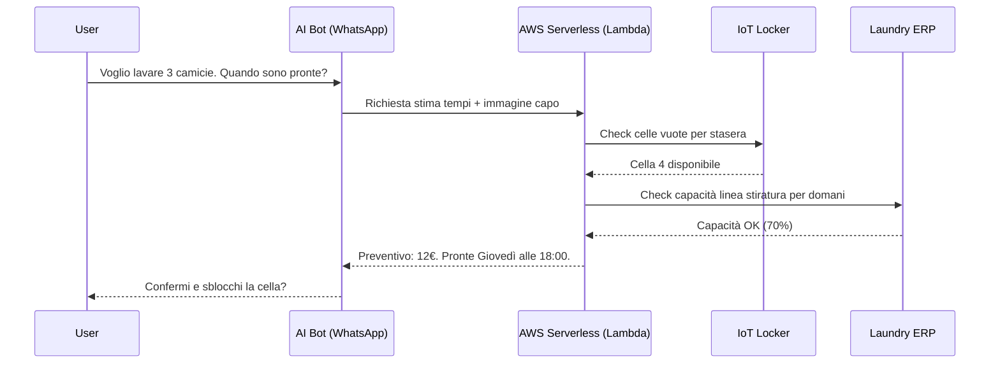

Aprire un punto vendita fisico per una lavanderia industriale che vuole servire i privati costa tra i **46.000 e i 132.000 euro** solo per avviarsi, più un affitto mensile che nelle grandi città italiane oscilla tra i 1.000 e i 4.000 euro. Sono dati del 2025-2026, non stime ottimistiche. A questi si aggiunge il personale, il BEP spesso oltre i due anni, e il vincolo geografico di un solo indirizzo.

Quando un'azienda B2B — strutturalmente efficiente, con volumi enormi e margini ottimizzati — decide di aprirsi al mercato consumer, si trova davanti a questa barriera economica. La domanda non è "vogliamo farlo?", ma "come lo facciamo senza diventare un'altra catena di negozi?".

La risposta che ho progettato bypassa il negozio fisico in favore di una rete di **Smart Locker IoT** posizionati strategicamente, gestiti da un **AI Concierge** conversazionale su WhatsApp. Ecco come ho strutturato l'architettura per trasformare la logistica da centro di costo a canale di acquisizione D2C.

---

## 1. Il "Ferro": intelligenza sull'Edge, perché la rete non è garantita

Un locker fisico su una via di Roma non può fermarsi perché il Wi-Fi ha un momento di crisi. Il cliente ha i vestiti dentro — e la fiducia nel servizio si costruisce o si distrugge esattamente in quei momenti.

Per questo ogni locker è stato progettato come un **edge node autonomo**:

- **Controller Python locale**: un microcomputer gestisce direttamente sensori di peso, prossimità e sblocco elettromeccanico delle celle.
- **Resilienza offline**: la comunicazione cloud avviene via **AWS IoT Core** con protocollo MQTT — leggero, bidirezionale, pensato per ambienti instabili. In caso di disconnessione, un demone Python locale gestisce la logica di fallback: il cliente ritira comunque in sicurezza, e i log di telemetria si sincronizzano al ripristino della rete.
- **Sicurezza**: ogni sblocco è validato da OTP criptati end-to-end, con snapshot video integrato a verifica del deposito.

Il costo di un'unità smart locker con IoT integration si colloca oggi tra i **6.000 e i 25.000 euro** a seconda della configurazione (fonte: Parcelhive, 2025). Anche prendendo il valore medio, un network di 10 locker ha un CAPEX hardware paragonabile all'affitto di un anno di un solo locale commerciale — senza i costi fissi mensili che seguono.

---

## 2. L'Interfaccia: niente app, solo una conversazione su WhatsApp

Chiedere all'utente di scaricare un'app è frizione. I dati lo confermano: in Italia ci sono **35 milioni di utenti WhatsApp** e il canale registra tassi di apertura dei messaggi Business intorno al **98%** — contro il 20% tipico dell'email (Infobip, 2025). Il 65% dei consumatori dichiara di essere più propenso ad acquistare da un brand che può messaggiare direttamente.

L'utente interagisce via WhatsApp con un bot guidato da **AWS Lex** e modelli LLM. Nessuna installazione, nessun account da creare: il canale che già usa diventa il punto vendita.

Il vero valore aggiunto è la **classificazione assistita**. Spesso il cliente non sa valutare il proprio capo: "È un piumone d'oca o sintetico?" "Questo cappotto è lana o misto?" Errori in fase di inserimento ordine generano resi, rilavorazioni, perdita di margine. Tramite il bot, l'utente scatta una foto e le API di **Amazon Rekognition** analizzano volumi e tessuto, suggerendo automaticamente il trattamento corretto.

Questo azzera gli errori di classificazione e apre una porta all'**upselling contestuale**: suggerire l'impermeabilizzazione su un cappotto in base al meteo previsto per la settimana, ad esempio, è un'automazione con ROI misurabile.

---

## 3. Il Cervello: Serverless, lead time dinamico e dynamic pricing

La vera sfida architettonica non è aprire uno sportello. È **promettere al cliente una data e un prezzo esatti** — e mantenerli.

Il backend è costruito su microservizi AWS (API Gateway, Lambda, DynamoDB) con un algoritmo di stima in tempo reale che incrocia tre variabili:

- **Stato della logistica**: quando passerà il furgone su quel locker specifico?
- **Capacità dell'impianto**: interrogando l'ERP della lavanderia, Lambda verifica se le linee di lavorazione sono sotto stress. Se la capacità supera il 90%, il sistema aggiunge automaticamente 24 ore alla stima comunicata al cliente.
- **Complessità del capo**: un tappeto ha tempi di lavorazione fisicamente diversi da una camicia — e il sistema lo sa.

Questa architettura abilita inoltre il **Dynamic Pricing**: se l'utente accetta una consegna "Eco" (+48 ore), ottimizzando i giri logistici, il sistema restituisce uno sconto immediato calcolato sul ROI dell'ottimizzazione. Non è una concessione commerciale: è un incentivo con un valore reale lato operazioni.

Il tutto gira su infrastruttura serverless, senza costi fissi di server — solo utilizzo effettivo. Il last-mile, che oggi rappresenta fino al **53% dei costi totali di spedizione** (Statista/Cascadia, 2024), viene in parte assorbito dalla rete di locker: il furgone ottimizza i giri su punti fissi invece di cercare indirizzi residenziali uno per uno.

---

## Conclusione: la logistica come prodotto, non come costo

L'idea di fondo di questo progetto è semplice: trasformare un'infrastruttura che esiste già — furgoni, impianti, personale — in un canale di acquisizione D2C senza aggiungere il peso di negozi fisici. Non è ottimizzazione incrementale: è un cambio di modello.

La tecnologia qui non è il fine. È la risposta economicamente sensata a una barriera concreta. Un locker IoT con edge computing, un bot WhatsApp e un backend serverless costano una frazione di un locale commerciale — e scalano senza costi fissi aggiuntivi per ogni nuova location.

La prossima domanda interessante non è "si può fare?" — i pezzi esistono tutti. È "quale categoria di business potrebbe applicare questo schema domani?"

---

*Fonti principali: Bsness.com (2025-2026) per i costi di apertura lavanderie in Italia; Parcelhive (2025) per i prezzi smart locker; Infobip/Electroiq (2025) per le statistiche WhatsApp Business; Statista/Cascadia (2024) per la quota last-mile sui costi di spedizione; Mordor Intelligence (2024-2025) per il mercato smart locker.*
